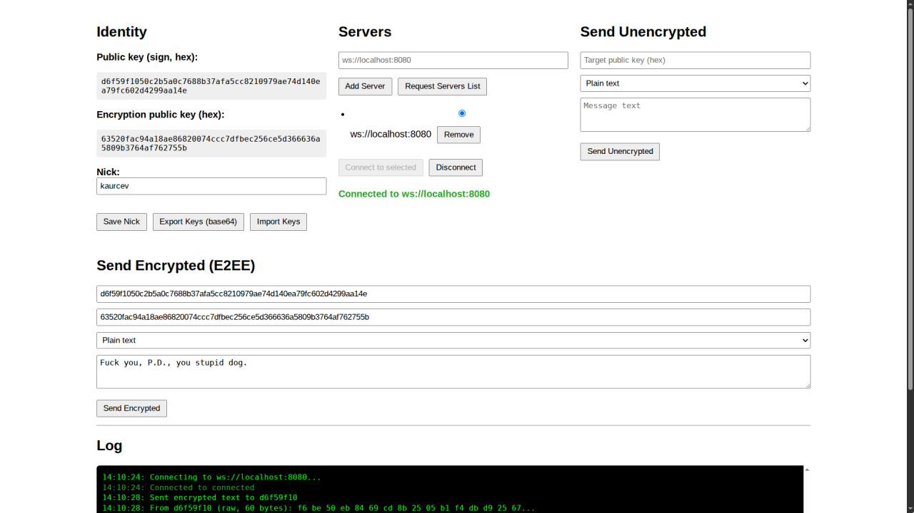
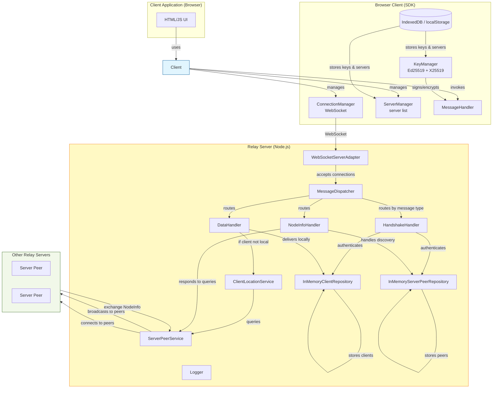

# MERK-BREP (Mesh Encryption Relay Kernel — Binary Relay Encryption Protocol)

**MERK-BREP** is a prototype implementation of a decentralized message relay system with end-to-end encryption. The system consists of relay servers forming a mesh network and a browser-based client SDK. It allows clients to exchange messages (text, JSON, files) through the relay network even if they are behind NAT or have no direct connection. The project is experimental and intended for research and demonstration purposes; it is not production-ready.





## Overview

The protocol uses WebSocket as the transport layer. All communication is framed with a binary header containing a magic number, protocol version, message type, sender ID (Ed25519 public key), and an optional signature (Ed25519). The payload can carry various types of data.

Key features derived from the current implementation:

- **Authentication and handshake:** Upon connection, the server sends a random challenge. The client responds with a signed copy of the challenge using its Ed25519 private key. The server verifies the signature and completes the handshake. This establishes the client’s identity and binds it to the connection.
- **Two key pairs per identity:**  
  - *Signing keys (Ed25519):* used for authentication and signing of `SIGNED_DATA` frames.  
  - *Encryption keys (X25519):* used for E2EE; a shared secret is derived via X25519, then AES-GCM is used to encrypt the payload.
- **Mesh network of servers:** Servers can connect to each other as peers. They exchange lists of known servers (`NODE_INFO_REQUEST_SERVERS` / `NODE_INFO_RESPONSE_SERVERS`) and automatically attempt to connect to newly discovered servers. This creates a self-organising overlay network.
- **Client location service:** When a server receives a `DATA` frame for a client that is not locally connected, it broadcasts a query (`NODE_INFO_QUERY_CLIENT`) to all peer servers. If another server has that client, it responds (`NODE_INFO_QUERY_RESPONSE`) with its own server key, allowing the original server to forward the message. This mechanism enables routing without a central directory.
- **Message types:**
  - `HANDSHAKE` – challenge/response and confirmation.
  - `DATA` – unencrypted, unsigned data (mainly for testing).
  - `SIGNED_DATA` – data with an Ed25519 signature (provides authenticity but not confidentiality).
  - `ENCRYPTED_DATA` – data encrypted with AES-GCM using a shared secret derived from X25519; the frame also carries an ephemeral public key and a signature of the encrypted payload.
  - `NODE_INFO` – various subtypes for server discovery and client location queries.

## Architecture

The codebase is split into two main parts: the server (Node.js) and the client SDK (TypeScript for browsers).

### Server Components

- **`RelayServer`** – the main class that initializes all repositories, handlers, and services, and starts the WebSocket server.
- **Repositories** (in-memory):
  - `InMemoryClientRepository` – stores connected clients (public key → connection).
  - `InMemoryServerPeerRepository` – stores known peer servers (public key → address + optional connection).
- **Handlers** (per message type):
  - `HandshakeHandler` – manages the challenge/response handshake for both incoming clients and outgoing server peers.
  - `DataHandler` – processes `DATA`, `SIGNED_DATA`, `ENCRYPTED_DATA` frames. For local clients it forwards immediately; otherwise it delegates to `ClientLocationService`.
  - `NodeInfoHandler` – handles server discovery and client location queries.
- **Services**:
  - `ServerPeerService` – manages outgoing connections to other servers, broadcasts messages to all peers.
  - `ClientLocationService` – tracks pending queries for remote clients and forwards messages when a peer responds.
- **WebSocket adapters**:
  - `WebSocketConnection` – implements the `IConnection` interface.
  - `WebSocketServerAdapter` – wraps the `ws` library, dispatches incoming frames to `MessageDispatcher`.
- **`MessageDispatcher`** – routes frames to the appropriate handler based on the message type.

### Client SDK

The client SDK is designed to be used in web applications. It provides:

- **Key management** (`Ed25519KeyManager`): generates and stores Ed25519 (signing) and X25519 (encryption) key pairs. Persistence is handled via an `IStorage` interface (IndexedDB or localStorage implementations are provided).
- **Connection management** (`WebSocketConnectionManager`): establishes WebSocket connection, encodes/decodes frames, emits events.
- **Server management** (`LocalServerManager`): stores a list of known server addresses and the currently selected server (using `IStorage`).
- **Message handling** (`MessageHandler`): processes incoming frames, emits high‑level events (`message`, `handshakeSuccess`, `serversDiscovered`, etc.). It also provides methods to send signed or encrypted messages.
- **High‑level client** (`Client`): ties all components together and exposes a simple API for applications. It supports:
  - Connecting to a selected server.
  - Sending text, JSON, or files (both plain/signed and encrypted).
  - Listening for incoming messages.
  - Discovering and adding new servers automatically from `NODE_INFO_ADD_SERVER` frames.

All client components use a typed event emitter pattern for loose coupling.

## Protocol Details

### Frame Format (binary)

Every WebSocket message is a binary frame with the following structure (120‑byte header + variable payload):

| Offset (bytes) | Size (bytes) | Field        | Description |
|----------------|--------------|--------------|-------------|
| 0              | 1            | Magic        | Always `0x58` |
| 1              | 1            | Version      | Currently `0x01` |
| 2              | 1            | Message Type | See `MsgType` enum |
| 3              | 1            | Reserved     | (zero) |
| 4              | 4            | Payload Length (big-endian) | Length of the payload that follows |
| 8              | 16           | Reserved     | (zero) |
| 24             | 32           | Sender ID    | Ed25519 public key of the sender |
| 56             | 64           | Signature    | Ed25519 signature (may be zero if not used) |
| 120            | variable     | Payload      | Message‑specific data |

### Message Types (`MsgType`)

| Value | Name            | Description |
|-------|-----------------|-------------|
| 1     | HANDSHAKE       | Handshake challenge, response, or confirmation |
| 2     | DATA            | Unsigned, unencrypted data (target client key in first 32 bytes of payload) |
| 3     | NODE_INFO       | Server discovery and client location messages |
| 4     | SIGNED_DATA     | Data with Ed25519 signature (authenticity, no encryption) |
| 5     | ENCRYPTED_DATA  | Encrypted data with signature of the encrypted payload |

### Handshake Flow

1. **Server → Client:** sends `HANDSHAKE` with a random 32‑byte challenge (payload = challenge, signature = zero).
2. **Client → Server:** sends `HANDSHAKE` with the same challenge in payload, signed with its Ed25519 private key (signature field filled, senderId set to client’s public key).
3. **Server → Client:** verifies the signature; if valid, replies with a `HANDSHAKE` confirmation (payload = `[1]`, signature = zero).

For outgoing server‑to‑server connections, the same flow is used, but both sides act as servers; they store each other as `IServerPeerInfo`.

### Node Info Subtypes

The payload of a `NODE_INFO` frame starts with a one‑byte subtype:

| Subtype | Name                     | Description |
|---------|--------------------------|-------------|
| 0       | NODE_INFO_REQUEST_CLIENTS| (unused in current code) |
| 1       | NODE_INFO_RESPONSE_CLIENTS| (unused) |
| 2       | NODE_INFO_REQUEST_SERVERS| Request the list of known servers from a peer |
| 3       | NODE_INFO_RESPONSE_SERVERS| Response containing a list of (public key, address) pairs |
| 4       | NODE_INFO_ADD_SERVER     | Inform peers about a new server address |
| 5       | NODE_INFO_QUERY_CLIENT   | Ask peers if they have a given client (by public key) |
| 6       | NODE_INFO_QUERY_RESPONSE | Response to a query: contains status (found/not found) and, if found, the server’s public key |

### Encryption Flow (E2EE)

1. The sender obtains the recipient’s encryption public key (X25519) – in the prototype this must be provided manually.
2. Sender generates an ephemeral X25519 key pair, derives a shared secret with the recipient’s encryption key, then hashes it to obtain an AES‑GCM key.
3. Sender encrypts the payload (with a leading byte indicating content type) using AES‑GCM with a random 12‑byte nonce.
4. Sender constructs an `ENCRYPTED_DATA` frame:
   - Payload: recipient’s signing public key (32 bytes) + ephemeral public key (32 bytes) + nonce (12 bytes) + ciphertext.
   - Signature: Ed25519 signature over the whole encrypted payload (using sender’s signing key).
5. Recipient, upon receiving, verifies the signature, extracts the ephemeral public key, derives the same shared secret, and decrypts.

## Running the Prototype

### Prerequisites
- Node.js (≥18)
- npm

### Server
1. Clone the repository:
   ```bash
   git clone https://github.com/kaurcev/MERK-BREP.git
   cd MERK-BREP
   ```
2. Install dependencies:
   ```bash
   npm install
   ```
3. Start a server:
   ```bash
   npm run dev:server
   ```
   The server listens on port `8080` by default. To change the port, set the `PORT` environment variable:
   ```bash
   PORT=9000 npm run dev:server
   ```
4. To connect to another server at startup, use the `--connect` argument:
   ```bash
   npm run dev:server -- --connect ws://example.com:8080
   ```

### Client Demo
1. In a separate terminal, start the Vite development server:
   ```bash
   npm run dev:client
   ```
2. Open `http://localhost:5173` in a browser.

The demo page allows you to:
- View your generated Ed25519 and X25519 public keys.
- Add servers (e.g., `ws://localhost:8080`) and select one.
- Connect/disconnect.
- Send text, JSON, or files (both unsigned/signed and encrypted).
- See incoming messages in the log panel.

## Current Limitations / Prototype Status

- **In‑memory storage:** Server repositories are in‑memory only; restarting the server loses all client and peer information.
- **No persistent routing table:** Client location queries are broadcast to all peers and have a 5‑second timeout; there is no caching of client locations.
- **No NAT traversal:** The system relies on WebSocket, which works through many NATs, but the prototype does not include any ICE/STUN/TURN mechanisms.
- **Manual encryption key exchange:** The demo requires the user to manually copy the recipient’s encryption public key. A future version might include key discovery.
- **Minimal error handling:** The code handles many basic errors but is not hardened for malicious inputs.
- **Single‑threaded:** The server runs on a single Node.js thread; for production, clustering or a more scalable architecture would be needed.

## License

Copyright (C) 2025 Alexsandr Kaurcev

This program is free software: you can redistribute it and/or modify it under the terms of the GNU General Public License as published by the Free Software Foundation, either version 3 of the License, or (at your option) any later version.

This program is distributed in the hope that it will be useful, but WITHOUT ANY WARRANTY; without even the implied warranty of MERCHANTABILITY or FITNESS FOR A PARTICULAR PURPOSE. See the GNU General Public License for more details.

You should have received a copy of the GNU General Public License along with this program. If not, see <http://www.gnu.org/licenses/>.


